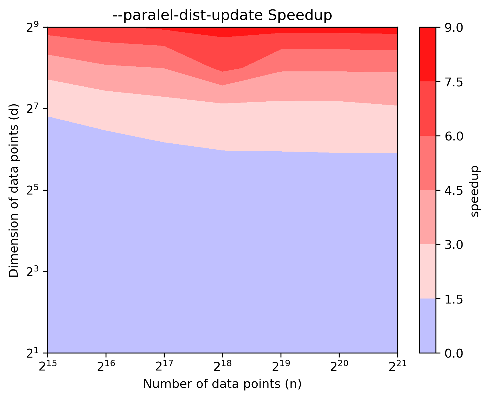
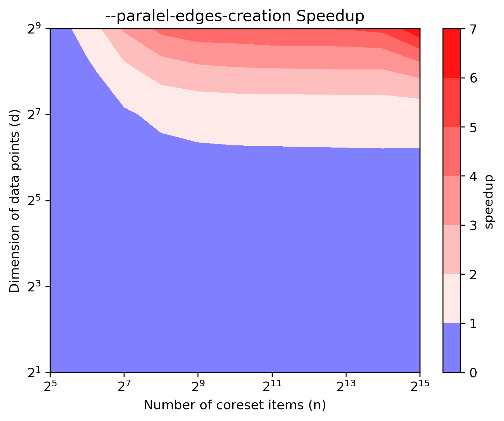

# Improved FMMD-S

An improved implementation of the FMMD-S algorithm from the paper:
>Wang, Y., Mathioudakis, M., Li, J., & Fabbri, F. (2023). Max-Min Diversification with Fairness Constraints: Exact and Approximation Algorithms. In Proceedings of the 2023 SIAM International Conference on Data Mining (SDM) (pp. 91–99). Society for Industrial and Applied Mathematics. https://doi.org/10.1137/1.9781611977653.ch11 

## Table of Contents

- [Improved FMMD-S](#improved-fmmd-s)
  - [Table of Contents](#table-of-contents)
  - [Algorithm Overview](#algorithm-overview)
  - [Setup](#setup)
    - [Python](#python)
    - [Gurobi](#gurobi)
    - [Cython](#cython)
  - [Balanced Sampling](#balanced-sampling)
    - [Old FMMD-S implementation Bottlenecks](#old-fmmd-s-implementation-bottlenecks)
  - [Speedup over original Implementation](#speedup-over-original-implementation)
  - [When to parallelize?](#when-to-parallelize)
  - [Full Experiment Results](#full-experiment-results)
  - [Limitations and Future Updates](#limitations-and-future-updates)


## Algorithm Overview

The FMMD-S algorithm described in the paper has the following four steps:

1. Obtain a greedy solution with `k` items using the Gonzales algorithm without regard for group constraints
2. For each group run the Gonzales algorithm to obtain a coreset and a diversity threshold
3. Creates a coreset graph where edges signify the distance between items are lower than the diversity threshold
4. Create the MIS problem using the coreset graph and solve using ILP solver
5. If solution is infeasible decrease diversity threshold and go to step 2, else return solution

The FMMD-S algorithm is available in [fmmd.algorithms](./fmmd/algorithms.py) is the `fmmd` function

```python
fmmd(
    features: np.ndarray,
    ids: np.ndarray,
    groups: np.ndarray,
    k: int,
    constraints: Dict[int,Tuple[int, int]],
    eps: float,
    time_limit:int = 300,
    verbose:bool = False,
    parallel_dist_update: bool = False,
    parallel_edge_creation: bool = False
) -> Tuple[set, float]:
    """The implementation of the Fair Max-Min Diversification algorithm.
    First obtains a greedy solution ignoring fairness constrains. Then obtains a coreset by 
    getting greedy solutions in each group. Solves the MIS problem on the coreset.

    Args:
        features (np.ndarray): The feature vectors of the items 
        ids (np.ndarray): The ids of the items  
        groups (np.ndarray): The group (int) of the items
        k (int): The minimum number of total samples required
        constraints (List[Tuple[int,int]]): The list of lower and upper limits on number of samples for each group 
        eps (float): The fraction to relax the diversity to get a solution.
        time_limit (int): The maximum number of seconds for Gurobi solver
        verbose (bool, optional): Print many debug statements. Defaults to False.
        parallel_dist_update (bool, optional): Whether to update distances in parallel. Defaults to False.
        parallel_edge_creation (bool, optional): Whether to create coreset graph edges in parallel. Defaults to False.
    Returns:
        Tuple[set,float]: Returns the solution as set of item ids and the solution diversity
    """
```
## Setup 

### Python 

```bash
conda env create -n fmmd -f env.yaml
```

### Gurobi

The FMMD-S algorithm uses [Gurobi](https://www.gurobi.com) to solve the MIS problem as explained in the paper. 

The gurobi optimizer can be used without a license for small datasets, but for larger datasets it is recommended to have an [academic licence](https://www.gurobi.com/academia/academic-program-and-licenses/).

### Cython
This library uses Cython to compile and parallelize several utility functions. 

Run the following command to build the module:
```bash
python setup.py build_ext --inplace
```

After building, the module is used like this:

```python
from fmmd.parallel_utils pdist
import numpy as np

X = np.random.random(1000,512)
d = pdist(X)
```

The `.pyx` is found in [ctython/parallel_utils.pyx](./cython/parallel_utils.pyx) and can be modified to add additional metrics and functionalities.

## Balanced Sampling

This library was developed specifically to perform balanced sampling.

Balanced sampling is when there is a need to uniformly sample from groups instead of the typical proportional 
sampling. Specifically, we wanted to perform balanced sampling when the distribution of groups was very skewed. This means that there are some groups with very few items and some groups with a lot of items. Furthermore, if `min_group_size` is the size of the smallest group and `k>min_group_size` then we might be forced to take all items from smaller groups. 

For example, assume we have the following group sizes:
|group|count |
|---:|----:|
|  1 |   2 |
|  2 |   5 |
|  3 |  10 |
|  4 | 200 |

Now, if we want to sample at least ten items uniformly `k>=10` then, we would need to select all items from group 1 and 3 items from the remaining groups. This would result in `k=11` items where we take a maximum of `3` from each group. This is what the `find_num_samples_per_group` method in the [datasets/naive_balanced_sampling.py](./datasets/naive_balanced_sampling.py) does. It returns `num_samples_per_group,total_number_of_samples` for a given group distribution and minimum number of samples. 


### Old FMMD-S implementation Bottlenecks

This sort of balanced sampling constraints causes several bottlenecks in the original FMMD-S implementation:

1. When entire groups need to be selected, the diversity threshold is relaxed several times until the constraints is not `under_capped`
2. The coreset graph typically is much larger as several groups are added directly. This results in a long time to compute the edges which satisfy the diversity constraints
3. When the ILP is infeasible steps 1 and 2 need to performed again

We fix these issues in the new implementations. Along with these fixes, a parallelization of several portions of the algorithm offer a general speedup compared the original implementation.


## Speedup over original Implementation

Running the benchmark on the Census dataset from the original paper.
For the full census dataset. `k` is the number of samples and `C` is the number of groups. 

New and improved algorithm implementation
```bash
python census_single_solution.py -k=10 -C=2
```

Original algorithm implementation

```bash
python census_single_solution.py -k=10 -C=2 --old
```

| k| C | Original (in seconds) | New (in seconds) | Relative Speedup |
|:---|---:|---:|---:|---:|
10 | 2 | 112.67 | 8.316 |  13.55x |
10 | 7 | 106.24 | 8.256| 12.87x |
50 | 14 | 474.152 | 10.503  | 45.14x |
100 | 14 | 3670.781 | 18.092  | 202.90x |

Experiments on an Apple MacBook Pro with a M2 Pro chip and 16GB RAM.

## When to parallelize?

The `gonzales_algorithm` method found in [fmmd/algorithms.py](./fmmd/algorithms.py) has the argument `parallel_dist_update`. This argument will parallelize the update to the distance array. The `gonzales_algoritm` is used in both step 1 and step 2 (see [Algorithm Overview](#algorithm-overview)) and can offer substantial speedups.

Therefore, to test the speed-up of one execution of the Gonzales algorithm, we executed the following for different number of items and feature dimensions:

```python
rng = np.random.default_rng(seed=42)
features = rng.random(size=(n,d))
ids = np.arange(n)
gonzales_algorithm(set(),features,ids,k=10,parallel_dist_update=True) # with parallel 
gonzales_algorithm(set(),features,ids,k=10,parallel_dist_update=False) # with parallel 
```

The result for speed up is shown in the figure below:
<p align="center">

</p>

All blue regions are where the parallel version is slower than the sequential version and all the red regions are where the parallel regions are faster than the sequential versions.


Similarly, the `get_coreset_graph` method in in [fmmd/algorithms.py](./fmmd/algorithms.py) has an argument `parallel_edges_creation`. This option uses the `fmmd.parallel_utils.edges` method to parallelize step 3 of the algorithm as described in [Algorithm Overview](#algorithm-overview). Again, the speed-up depends on the number of items in the coreset and the dimensionality of each item. 

Therefore, to test the speed-up offered by the parallel version, we run the following two methods with random data of different coreset size and dimensions:

```python
rng = np.random.default_rng(seed=42)
features = rng.random(size=(n,d))
parallel_utils.edges(features,0.01) # parallel edge creation
parallel_utils.edges_sequential(features,0.01) # sequential edge creation
```

The results are shown below:
<p align="center">

</p>
All blue regions are where the parallel version is slower than the sequential version and all the red regions are where the parallel regions are faster than the sequential versions.

> The number of coreset items depends on the data features, the number of samples `k` and the constraints for the FMMD problem.

As discussed above, the parallel options are only useful when the number of dimensions increase.
Therefore, using the full `768` dimensional embeddings for the ECCO dataset, we select `k=500` balanced samples as follows:
```bash
python ecco_balanced_samples.py -k=500  --eps=0.5
```

The `fmmd` method found in [fmmd/algorithms.py](./fmmd/algorithms.py) has two options to utilize multiple cores:
1. `--parallel-dist-update`: Update the solution distances in parallel for the Gonzales algorithm
2. `--parallel-edge-creation`: Find the coreset edges in parallel which are below the diversity threshold

For the ECCO dataset and balanced sampling we observe the following trends:


| `--parallel-dist-update`| `--parallel-edge-creation` | Running Time | Relative Speedup |
|:---:|:---:|---:|---:|
| ❌|❌ | 4444.224 | 4.55 |
| ✅| ❌| 1781.913 | 1.82 |
|❌ |✅ | 3625.860 | 3.71 |
| ✅| ✅ | 976.961 | 1.00 |

The above ablation results indicate the majority of the speedup is gained from the parallel updates and that the speedup from parallel edge creation is relatively smaller potentially due to the number of coreset items.

## Full Experiment Results

For the ECCO dataset, there are 4.2 million items and 137 groups with a very skewed distribution. The requirement was at least 3000 balanced samples. With the group distribution resulted in the following:
1. Maximum of `26`  samples from each group
2. `3063` total samples


The items are `768` dimensional embedding which take 3min to load the 22GB vectors.


The FFMD-S solution takes 9250.9 seconds (2.5hrs).


The FMMD-S algorithm has the following stages:
1. Finding an initial greedy solution without thinking of buckets: **1615.6 sec**
2. Finding a core-set of the data from buckets starting from the initial samples : **1832.83 sec**
3. Computing pair-wise distances and selecting ones which are below a diversity threshold: **5779.5  sec**
4. Creating a coreset graph with nodes from 2 and edges from 3: **0.69 sec**
5. Solving an Integer Linear Program of a coreset from 4 to get final solution: **17.27 sec**

All these times are on a system with 40 cores and 80GB RAM (of which only 25GB was actually used)
The main bottleneck as seen is step 3. This is because we end up with 274,398 items in the coreset leading to the computation of nearly 37B pair-wise distances. After step 3 we only have 253 edges below the required threshold, so the rest of the algorithm is very quick.


## Limitations and Future Updates

There are some limitations compared to the original implementations. These will be addressed as the need arises.

1. Only supports L2 distance metric
2. No ability to generate multiple solutions in parallel to obtain best overall diversity
   

